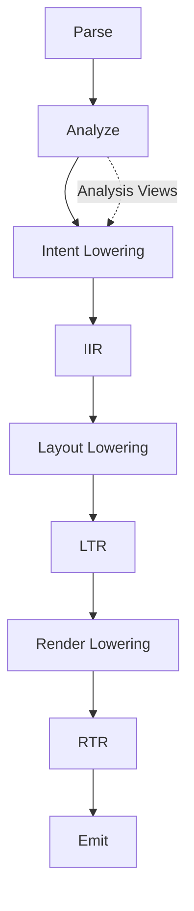
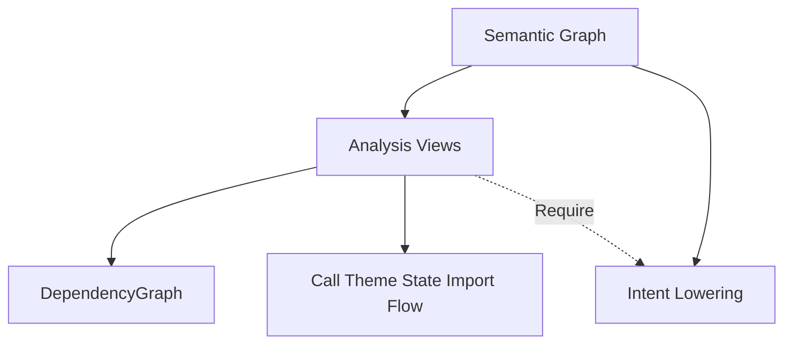

# Architecture

This document describes the **Compilation Architecture** of OurUI. Diagrams of phase order are the **Compilation Flow**.

## Technical slogan

> Developer writes intent. Compiler writes implementation. Host receives primitives.

## OurIR — IR Stack

**OurIR** is the IR ecosystem (not a single layer):

| Stage | Name | Role |
|---|---|---|
| **IIR** | Intent IR | Developer intent (Intent / Behavior / Presentation domains) |
| **LTR** | Layout Object Tree | Result of Layout Lowering (may evolve toward a layout graph if constraints require it) |
| **RTR** | Host-independent Render Tree | Tree of **HostNode** values ready for emitters |

Emitters (HTML, PDF, …) consume only **RTR** through the **HostNode** interface (I2).

## Compilation Flow

```text
Parse → Analyze → Lower → Optimize → Emit
```



| Phase | Responsibility |
|---|---|
| **Parse** | Source → Python AST |
| **Analyze** | Import/symbol/type resolution, Semantic Graph, Analysis Views |
| **Lower** | Intent → IIR; Layout → LTR; Render → RTR |
| **Optimize** | Transforms (may re-Analyze) |
| **Emit** | Host emitters |

**P0–E** implements Parse → Analyze → Intent / Layout / Render Lowering → JSON dump and HTML emit. Generations **1–3**, Phase **S1–S6**, **1.0** freeze, Enterprise **E1–E5**, and host security (**1.6.0**) are complete. Host Contract: emit requires RTR + Resolved Design. See [docs/roadmap.md](docs/roadmap.md).

## Semantic Graph and Analysis Views

The **Semantic Graph** is the source of analysis truth.

**Analysis Views** are derived indexes (I8), not flow stages. They share an `AnalysisView` contract so passes can `Require<DependencyGraph>()`, etc.

Initial views: DependencyGraph, CallGraph, ThemeGraph, StateGraph, ImportGraph, FlowGraph.



## IIR domains

| Domain | Question |
|---|---|
| Intent Domain | *what* (`Hero`, `Dashboard`, …) |
| Behavior Domain | *behavior* (events, state, server calls) |
| Presentation Domain | *how it should present* before layout |

## HostNode (RTR)

RTR is a tree of **HostNode** kinds, for example: `Container`, `Leaf`, `Text`, `Drawing`, `Slot`. Emitters map HostNodes to host primitives (`div`, `button`, …). Button is not a universal primitive.

## Node identity

See [spec/ir/node.md](spec/ir/node.md): `id`, `kind`, `span`, `attributes`, `metadata`, `children`, `provenance`, `revision`, `generation`, `hash`.

## Package layout

```text
compiler/analysis/   # Analyze + Analysis Views
compiler/lowering/   # Intent / Layout / Render lowering
compiler/optimize/
compiler/emit/
packages/ourui/      # Python implementation (P0+)
```

## Phase roadmap

| Phase | Delivers |
|---|---|
| **A–E** | Docs freeze → dump → LTR → RTR → HTML |
| **F–R** | JS/`@server`/State/serve/LSP/tokens/package |
| **S1–S6** | Link/Shell → forms → Nav → tokens → layout → motion → Canvas → polish (`0.4.0`) |

Do not invent new Stable vocabulary without ADR/RFC. See [VISION.md](VISION.md).

## Related

- [INVARIANTS.md](INVARIANTS.md)
- [COMPILER_BOOK.md](COMPILER_BOOK.md)
- [spec/ir/overview.md](spec/ir/overview.md)
