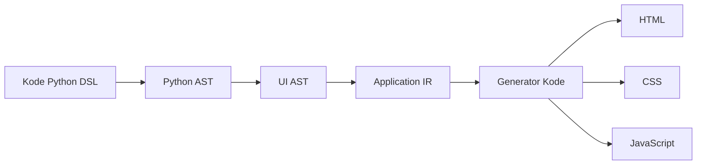

# Ringkasan Eksekutif  
Platform **Python-first, Rust-powered** ini dirancang untuk mempermudah pengembangan aplikasi SaaS modern dan fitur AI, dengan prinsip *“tulis Python, kompilasi native, jalankan cepat”*. Visi utamanya adalah memberikan lingkungan full-stack terpadu bagi pengembang Python: semua lapisan (frontend UI, backend API, database, real-time, AI) ditulis dalam Python, tetapi mesin kompilasi Rust di balik layar memastikan performa tinggi. Pendekatan ini meniru keberhasilan Flyte 2.0 yang “menjaga Python sebagai permukaan authoring… berlapis core Rust”. Dengan DSL deklaratif berbasis Python dan sistem *design-token*, platform ini menjanjikan lintasan pengembangan lebih cepat (time-to-market), konsistensi desain, dan kinerja browser optimal (output HTML/CSS/JS tanpa runtime berat). Metrik keberhasilan termasuk adopsi oleh tim Python (misal jumlah aplikasi, waktu pengembangan) dan metrik teknis (throughput permintaan, waktu respons UI). Risiko masuk pasar meliputi loyalitas pada ekosistem JS yang sudah mapan, beban pengembangan platform yang kompleks, dan resistensi terhadap perubahan. 

# A. Visi, Prinsip, dan Spesifikasi Produk  

**Visi & Target:** Platform ini menyasar *pengembang Python* (back-end, data scientist, ML engineer) yang ingin membangun aplikasi web SaaS/AI tanpa terjebak ekosistem JavaScript. Dengan menggabungkan kemudahan Python dan kekuatan Rust, visinya adalah **“satu bahasa, satu stack, pengalaman runtime native”**: satu kodebase Python → semuanya terkompilasi menjadi HTML/CSS/JS native. Pendekatan serupa diterapkan Flyte 2.0: “Flyte 2.0 adalah jawaban kami: *keep Python as the authoring surface… with a Rust core*”. Keunggulan strategis Python – sintaks bersih, ekosistem luas, prototyping cepat – ditonjolkan dalam konteks SaaS/AI.  

**Prinsip Desain:** Prinsip utama meliputi (1) **Python-First**: seluruh UI, logika server, dan data ditulis dengan sintaks Python yang familiar; (2) **No JS/Rumah Tangga Terpisah**: developer tidak menulis HTML/CSS langsung atau mempelajari JS (reflex: “No JavaScript, no separate API… just Python”); (3) **Compile-Time**: UI dikompilasi menjadi HTML/CSS/JS tanpa virtual DOM atau runtime besar (ala Svelte/Astro); (4) **Design-System Native**: tema (warna, tipografi, spacing, animasi) diwakili sebagai *token* yang dapat diatur secara global; (5) **AI & Real-Time by Design**: dukungan bawaan untuk agent/pipeline AI (contoh: Reflex MCP/Skills) dan sinkronisasi real-time (websocket, data stream) untuk kasus penggunaan canggih.  

**Positioning & Proposisi Nilai:** Dibanding solusi konvensional (misal *Django+React* atau *FastAPI+Next.js*), platform ini menawarkan pengurangan friksi besar: *“no context switching”* karena satu bahasa, produktivitas tim meningkat (90% fungsionalitas umum SaaS siap pakai), dan skalabilitas tinggi lewat Rust (Flyte 2.0 mampu 10Gbps NIC, 10k tugas konkuren). Dengan desain token, perubahan tema global (mis. ganti skema warna) dapat terjadi tanpa refactor besar, mendukung skala besar. Platform juga memadukan frontend/backend: fungsi Python dapat ditandai sebagai *server function* yang otomatis menjadi endpoint (REST/WebSocket) saat dibutuhkan.  

**Metrik Keberhasilan (Metrics):** Keberhasilan diukur dari metrik berikut:  
- **Adopsi Developer:** *adopsi* di komunitas Python (jumlah project/tim yang migrasi), waktu rata-rata membangun MVP berkurang, dan kecepatan iterasi (fitur per sprint).  
- **Performa Aplikasi:** throughput HTTP (rps) vs latensi; waktu muat halaman (Time-to-Interactive < 1s pada perangkat mid-range); konsumsi memori browser (target mendekati 0 runtime).  
- **Produktivitas Tim:** pengurangan baris kode/front-end dev (hingga 0 baris JS), waktu on-boarding developer baru (penurunan signifikan karena hanya Python).  
- **Kualitas & Teknis:** cakupan fungsi tersedia (“batteries included”), kestabilan fitur AI/hot-reload, tingkat bugs.  
- **Bisnis:** jumlah SaaS/fitur AI yang di-launching, retensi (NRR) pengguna platform, ROI inisiatif AI (analogi kasus Toyota/Union.ai).  

**Risiko Pemasaran (Go-to-Market Risks):** Risiko utama meliputi:  
- *Dominasi ekosistem JS:* popularitas React/Node mungkin membuat tim hesitan pindah.  
- *Kurangnya ekosistem komponen:* perlu membangun komponen UI inti (Button, Form, Chart, dll.) dari nol atau integrasi eksternal, sehingga butuh waktu.  
- *Kebutuhan Fitur Lengkap:* SaaS scale memerlukan autentikasi, multi-tenant, real-time, yang harus di-cover agar kompetitif.  
- *Kinerja Awal:* Gagal memenuhi janji kinerja (mis. terlalu lambat compile atau runtime JS tertinggal) dapat memupus kepercayaan.  
- *Kompleksitas Pengembangan:* Proyek inti kompleks (parsing Python, integrasi Rust/Python, LSP, deployment). Gagal mengelola scope MVP dapat delay peluncuran.  

Berikut tabel ringkasan SWOT dengan framework lain dalam konteks Python/SaaS/AI:

| Framework      | *Strengths*                                      | *Weaknesses*                                      | *Opportunities*                                    | *Threats*                                           |
|----------------|--------------------------------------------------|----------------------------------------------------|----------------------------------------------------|-----------------------------------------------------|
| **React/Next.js**  | Ekosistem & komunitas terluas, performa memadai, SSR (Next) | Runtime besar (React/JSX kompleks), banyak pilihan (Redux, dll.), kurva belajar tinggi | Pilihan banyak library (GraphQL, Auth, UI kit)  | *Waktu muat* berat (SPAs penuh JS), alternatif lebih ringan (SvelteKit, Astro) |
| **Vue**        | Mudah dipelajari, sintaks deklaratif, tooling baik  | Ekosistem lebih kecil dari React, kurang fokus Python | Penggunaan di dashboard/admin apps                | Dominasi React di enterprise, kurang Python support  |
| **Svelte/SvelteKit** | Bundle minimal, fast (compiled), DX sangat baik | Komunitas kecil, belum ada penekan aplikasi Python, learning curve reaktivitas reaktif baru | Performa-first apps (games, visualisasi)        | Ekosistem terbatas, challengers (React/Vue)         |
| **Reflex (Pynecone)** | *Pure Python full-stack*, AI-oriented, deploy mudah (demo internal), tanpa JS untuk dev | Sangat baru, komunitas kecil, bergantung internals React/Next.js, closed-source? | Internal tools & AI apps (klien enterprise)       | Tidak terbukti skala besar, kompetisi (Next, Streamlit)  |
| **Anvil**      | Drag-drop GUI builder, cuma Python, hosting terintegrasi  | Client-side Python via Skulpt (terbatas), lock-in, sulit debug | Prototype cepat untuk non-dev                    | Keterbatasan fitur, tidak performa untuk beban berat |
| **Astro**      | Zero-JS default (fast loading), SEO-friendly, multi-UI (React/Vue/Svelte) | Fokus static content, tidak dirancang untuk aplikasi *real-time*, Python support: ada plugin | Blog, dokumentasi, marketing site, partial-islands | Framework SPA terus berkembang, tidak fokus Python  |

*Catatan:* React/Next dan Astro terutama bersaing di ranah JavaScript, sedangkan reflex/anvil mendekati “Python-fullstack” kita. Platform ini berusaha mengisi kekosongan: DSL Python yang dikompilasi (layaknya SvelteKit/Astro) dengan mesin Rust performa tinggi, sekaligus penuh fitur SaaS (authentication, real-time, AI) seperti Reflex/Anvil, namun tanpa runtime Python di browser.

## Spesifikasi Produk & Roadmap (Ringkasan)  
- **Fokus MVP Awal:** DSL dan pipeline kompilasi sederhana (Python → HTML/CSS).  
- **MVP Lanjutan:** Tambah state reaktif (sinkronisasi via WebSocket/API), theming dinamis, dan routing.  
- **Tahap Final:** Optimasi (tree-shake, CSS merging), LSP/IDE support, opsi ekspor lain (PDF/email), dan integrasi Rust untuk kinerja build.  

| *Milestone*                       | *Deskripsi*                                              | *Waktu*      |
|-----------------------------------|----------------------------------------------------------|--------------|
| **1. Bahasa & AST Awal**          | Rancang DSL Python (primitif & komponen inti), definisi AST UI. | Bulan 1–2    |
| **2. Kompilasi HTML Dasar**       | Implementasi transpiler (Python AST → UI AST → IR → HTML), output statis HTML/CSS. | Bulan 3–4    |
| **3. CSS/Tema**                   | Tambah engine tema/design-token; hasilkan CSS dari atribut (warna, ukuran).  | Bulan 5–6    |
| **4. State & Event**              | Tambah model *state* reaktif dan *event handlers* (click, input); hasilkan JS minimal (websocket/REST). | Bulan 7–8    |
| **5. Full-stack (Backend)**       | Definisikan *server functions* Python (API otomatis), autentikasi, database. | Bulan 9–10   |
| **6. Optimalisasi & Tooling**     | Tambah optimasi (tree-shaking, dead code), bundler JS, dev server + HMR, LSP support. | Bulan 11–12  |
| **7. Rust Engine**                | Port bagian performance-critical (IR transform, optimizer) ke Rust/PyO3 (opsional setelah stabil). | Rilis 1.0+   |

Risiko teknis diringkas dalam **Tabel Risiko**:

| *Risiko*                               | *Dampak*                | *Mitigasi*                              |
|----------------------------------------|-------------------------|-----------------------------------------|
| Kompleksitas compiler tinggi           | Penundaan pengembangan  | Mulai prototipe Python, iterasi cepat   |
| Adopsi lambat (tersaing JS ecosistem)  | Gagal raih pengguna     | Target niche SaaS/AI dulu, dokumentasi kuat |
| Fitur tidak lengkap                    | Kehilangan pengguna     | Fokus fitur inti SaaS (auth, real-time) |
| Performa tidak memenuhi ekspektasi     | Reputasi buruk          | Benchmark, optimasi (Rust), tune engine |
| Resource Tim (skill kurang)            | Keterlambatan           | Rekrut talent (fullstack Python/Rust)   |

# B. Desain DSL Python  

**Rasional:** DSL (Domain-Specific Language) memastikan developer menulis UI dengan gaya yang natural bagi mereka. Alih-alih “HTML dalam Python” (yang redundan), DSL ini harus berbicara *niat/desain*. Seperti Martin Fowler jelaskan, *design tokens* memisahkan gaya dari kode bisnis. Oleh karena itu, DSL akan menawarkan komponen dan properti bermakna (variant, size, theme token) daripada kelas CSS string. Dengan DSL deklaratif (mirip Flutter/SwiftUI namun Pythonic), pembuatan antarmuka UI bertambah jelas dan konsisten.  

**Sintaks Contoh:** 
```python
from ourui import ui

page = ui.Page(
    ui.Hero(
        title="Sambut 2026",
        subtitle="Bangun SaaS & AI lebih cepat",
        cta=ui.Button("Get Started", variant="primary")
    ),
    ui.Section(
        title="Fitur Utama",
        children=ui.Grid(
            ui.Card("Data Analysis"),
            ui.Card("Machine Learning"),
            ui.Card("Realtime Updates"),
        )
    ),
    ui.Footer()
)
```
atau dengan chaining style:
```python
ui.button("Submit", color="primary", radius="lg", px=6, py=3)
```
Kode di atas menggambarkan *Page* yang disusun dari komponen *Hero*, *Section*, *Card*, dll. Properti komponen (`variant="primary"`, `radius="lg"`) mengacu pada token tema, bukan kode CSS langsung. 

**Primitif Inti:** DSL menyediakan blok bangunan dasar seperti `Text`, `Heading`, `Button`, `Image`, `Link`, `Input`, `Grid`, `Column`, `Row`, `Stack`, `Form`, `Table`, dsb. Komponen layout (`Column`, `Grid`, `Stack`) mengatur anaknya secara horizontal/vertikal dengan parameter jarak (`spacing`, `align`, `justify`). Komponen visual (`Button`, `Input`, `Card`, `Icon`) mewakili elemen UI umum. Setiap komponen memiliki properti yang relevan: misalnya `Button(text, on_click, color, size)`, atau `Grid(columns, gap)`.  

**Model Komponen:** Komponen dapat didefinisikan sebagai fungsi atau kelas. Contoh kelas komponen custom:
```python
from ourui import Component, Column, Heading, Text, Button

class GlassCard(Component):
    def __init__(self, title, content):
        self.title = title
        self.content = content

    def build(self):
        return Column(
            Heading(self.title),
            Text(self.content),
            Button("Learn More"),
            bg="rgba(255,255,255,0.7)", blur="8px", border=True, rounded="lg"
        )
```
Di sini `GlassCard` membentuk layout kolom dengan latar belakang transparan. Komponen user-defined ini terdiri dari komponen bawaan. Compiler akan memasukkan struktur tersebut ke UI AST/IR. Pendekatan berbasis kelas (seperti di atas) memudahkan reuse dan state, sedangkan fungsi murni juga dapat digunakan untuk komponen stateless.  

**State & Reaktivitas:** DSL mendukung state reaktif, mirip konsep *signals* atau *stores*. Misalnya:
```python
count = State(0)

def increment():
    count.set(count.value + 1)

ui.Button(f"Count {count.value}", on_click=increment)
```
Di balik layar, setiap perubahan `count` memicu kompilasi ulang bagian UI terkait. Pendekatan serupa digunakan Reflex/ReactPy: state sebagai variabel Python dipantau. Reaktivitas ini dioptimalkan saat kompilasi: hanya komponen yang merujuk state yang diperbarui.  

**Event Handling & Fungsi Server:** DSL menyediakan event bawaan seperti `on_click`, `on_change`, `on_submit`, dan sebagainya. Handler-nya dapat berupa *server function* Python. Misalnya:
```python
@server
def save_data(data):
    # simpan ke DB
    ...

ui.Button("Save", on_click=save_data)
```
Tagar `@server` menunjukkan fungsi ini dipanggil di server (Rust engine) saat event terjadi, tanpa kode JavaScript eksplisit. Sistem otomatis membuat endpoint atau socket untuk komunikasi UI-server. Model ini mirip NiceGUI yang “hanya Python” dengan FastAPI+Vue di baliknya.  

**API Tema/Design Token:** Untuk konsistensi visual, warna dan metrik desain disimpan di theme. Contoh definisi tema:
```python
theme = Theme(
    colors={"primary": "#3B82F6", "danger": "#EF4444", "background": "#F3F4F6"},
    font_size={"sm": "0.875rem", "lg": "1.125rem"},
    radius={"md": "4px", "xl": "12px"},
    spacing={"1": "0.25rem", "4": "1rem", "8": "2rem"}
)
```
Kemudian, properti komponen menggunakan token ini:
```python
ui.Button(
    "Delete",
    color="danger",
    font_size="lg",
    radius="md",
    px=4, py=2
)
```
Compiler menghasilkan HTML/CSS kelas unik. Misalnya CSS hasilnya:
```css
.btn_xy12 { 
  background-color: #EF4444; 
  color: white; 
  font-size: 1.125rem; 
  border-radius: 4px; 
  padding: 0.25rem 1rem; 
}
```
Sistem preset juga disarankan: definisikan satu set gaya bernama, misalnya:
```python
button_primary = {"bg": "primary", "text": "white", "radius": "lg", "px": 6, "py": 3}
ui.Button("Submit").apply(preset("button_primary"))
```
yang menghasilkan CSS `.btn_abcd { background: #3B82F6; color: white; padding: 1.5rem; border-radius: 0.75rem; }`. Pendekatan token memudahkan otomatisasi desain konsisten.  

**Responif & Animasi:** Bahasa DSL menyertakan sintaks responsif, misalnya:
```python
ui.Button(
    "Login",
    w={"sm":"100%", "md":"auto"},
    p={"mobile": 3, "desktop": 6}
)
```
Compiler menghasilkan *media query* sesuai. Untuk animasi, token gerak bisa ditentukan, misalnya `enter="fadeIn"` atau `transition={"duration":300}`, sehingga menghasilkan atribut animasi CSS. Contoh:
```python
ui.Card("Hello", enter="slide-up", duration=300)
``` 
yang memicu transisi CSS. (Detail implementasi animasi mengikuti library CSS/WASM populer).  

**Ekstensibilitas & LSP/IDE:** DSL dirancang agar mudah diperluas. Developer dapat membuat komponennya sendiri (seperti `GlassCard` di atas) tanpa mengubah inti platform. Dengan tipe statis (menggunakan `TypedDict` atau `pydantic`), serta integrasi LSP Python (misal pyls atau Pyright), editor bisa memberikan *autocomplete* dan validasi. Misalnya setelah mengetik `color=`, IDE menyarankan token warna yang valid. Fitur ini mirip design-token yang “data as first-class”, sehingga tim desain dan pengembang berbagi referensi tunggal.  

**Migrasi dari Stack Eksisting:** Bagi tim React/JSX, transisi DSL memerlukan adaptasi pola. Namun kami dapat menyediakan konverter atau template: misalnya `<Button variant="primary">Login</Button>` di JS dapat diterjemahkan ke `Button("Login", variant="primary")`. Tim Django/Flask cukup mengganti template HTML dengan kode DSL, tanpa harus belajar JavaScript. Dengan DSL deklaratif, perubahan design system pun lebih mudah daripada mengganti string kelas Tailwind. 

**MVP Scope & Tech:** Prioritaskan rancangan bahasa dan prototipe kompilasi statis (Python ast ➔ UI AST). Gunakan modul `ast` bawaan Python untuk parse kode (mengurangi kompleksitas pembuatan parser). Fitur CSS/tema bisa diimplementasi awal lewat Python sederhana, sementara optimasi kinerja nanti dialihkan ke Rust. Layanan IDE berbasis LSP disiapkan, menggunakan Python (Pyright) dan Rust (rust-analyzer). Untuk preview/UI, dapat memanfaatkan server dev berbasis FastAPI atau elemen Rust async (Tokio) dengan WebSocket.

# C. Representasi Antarmuka Aplikasi (IR)  

**Struktur Formal IR:** IR (Intermediate Representation) adalah pohon node terstruktur yang mewakili UI statis dan dinamis. Setiap node memiliki *type*, *props* (atribut), dan daftar *children*. Contohnya:
```json
{
  "type": "Button",
  "props": {"text": "Login", "variant": "primary"},
  "children": []
}
```
Node jenis dasar: `Text`, `Button`, `Input`, `Image`, `Link`, `Grid`, `Column`, `Row`, `Form`, `List`, dll. Masing-masing membawa atribut khusus (misalnya `Input` punya `name` dan `value`, `Grid` punya `columns` dan `gap`). Struktur ini dapat distatiskan dengan typing (contoh: `@dataclass` atau `TypedDict`) untuk validasi awal sebelum serialisasi.

**Serialisasi & Format:** IR diekspor sebagai data terstruktur. Opsi: *JSON* (mudah dibaca, tetapi agak berat), *MessagePack* (biner efisien), atau *Protobuf* (dengan schema). Mengingat keinginan interoperabilitas dan kinerja, menggunakan Protobuf via library Rust seperti *Prost* adalah pilihan solid. Contoh definisi Proto:
```proto
message Node {
  string type = 1;
  map<string, string> props = 2;
  repeated Node children = 3;
}
```
Kemudian generator kode Serde/Prost otomatis memetakan ke struct Rust/Python. Protobuf juga memudahkan penambahan target lain (misal frontend dalam bahasa lain) karena format baku.

**Pipeline Transformasi:** Alur kompilasi adalah:
1. **Python AST** – Kode sumber DSL di-*parse* dengan `ast.parse`, menghasilkan AST Python standar.  
2. **UI AST** – Fase ini memfilter node AST yang relevan (panggilan fungsi komponen, assignment State, decorator server) dan membangun *AST UI* khusus. Misalnya sebuah `Call` ke `Button("OK", color="primary")` menjadi objek `UIAST.Button(text="OK", color="primary")`.
3. **Application IR** – UI AST lalu di-*linearize* ke IR final (menghilangkan konstruksi Python seperti loop/if, menggantikan dengan IR yang eksplisit). Contoh, loop UI `for item in list: Column(...).props({"key": item})` menjadi node IR spesial “ForLoop” atau di-unroll. Jika ada `if False:`, node tersebut di-**tree-shake** (dihapus).  
4. **CodeGen** – IR diubah jadi output: HTML/CSS/JS. Sebagai contoh, `IR(type="Button")` menjadi `<button>` HTML dengan kelas CSS, dan `IR(type="Grid")` menjadi wrapper `<div>` dengan display:grid. Sembari itu, kumpulan CSS digenerate (lihat bagian Stylesheet). Event handlers menjadi atribut JS (onclick) atau data-* untuk websocket. Umpamanya, IR:
   ```json
   {"type":"Column", "children": [
       {"type":"Text", "props":{"text":"Hello"}},
       {"type":"Button", "props":{"text":"Next"}}
   ]}
   ```
   diterjemahkan menjadi:
   ```html
   <div class="col"> 
     <p>Hello</p>
     <button class="btn_xyz">Next</button>
   </div>
   ```

Diagram di bawah (flowchart) menggambarkan alur umum pipeline:  

  
**Optimalisasi (Pass Compiler):** Sebelum gen kode akhir, beberapa *pass* optimasi dijalankan:  
- *Dead Code Elimination:* Menghapus node yang tak dipakai. Misal blok `if False:` seluruhnya dihilangkan. Jika variabel `DEBUG = False`, komponen debug dihapus statically.  
- *Tree Shaking & Inline:* Komponen yang hanya satu kali digunakan bisa di-inline, dan pemanggilan yang redundant dihapus.  
- *CSS Merge:* Jika beberapa node menghasilkan aturan CSS identik, gabungkan ke satu kelas. Misal 100 tombol “primary” cukup 1 kelas `.btn-primary`. Ini mengurangi ukuran CSS akhir.  
- *Constant Folding:* Ekspresi Python statis (mis. `"Hello " + "World"`) dihitung dulu, sehingga IR hanya membawa `"Hello World"`.  
- *Ubah Nama (Minify):* Nama kelas CSS dan variabel JS dapat diperkecil (di bundler) untuk footprint minimal.  

**Multi-Target Rendering:** Walau fokus awal ke *web*, desain IR memungkinkan target lain:  
- **HTML/CSS/JS (Web):** Output utama untuk browser, dengan dukungan penuh interaktivitas.  
- **Mobile (misal via React Native/Flutter):** Dalam jangka panjang, IR bisa ditranspiler ke native rendering (dart/flutter atau JS/ReactNative) dengan strategi serupa AST.  
- **PDF & Cetak:** IR HTML/CSS bisa di-*render* ke PDF (contoh: menggunakan headless Chrome atau wkhtmltopdf), berguna untuk faktur atau laporan.  
- **Email HTML:** IR yang disederhanakan (CSS inline, tanpa JS) agar kompatibel di client email.  

**Strategi Hydration & Footprint Runtime:** Kami menargetkan *zero JS runtime* di browser. Mirip Astro, sebagian besar UI dibuat statis. Komponen yang membutuhkan interaktivitas “dihidupkan” secara selektif (Islands Architecture): compiler menyematkan sedikit JS untuk binding event saja. Contohnya, tombol dengan `on_click` diberi atribut `onclick` yang memanggil WS, tanpa library JS besar. Pendekatan ini menghindari Virtual DOM: *UI statis ➔ hanya tambahkan handlers*. Ringkasnya, sebagian besar halaman tetap HTML/CSS, menghindari payload JS monolitik SPAs. Kami menargetkan footprint sangat ringan (misal <10KB) untuk runtime minimal (hanya *shim* WebSocket atau XHR). 

**MVP dan Teknologi:** Pada awal, implementasi 100% Python memudahkan iterasi DSL. Kami gunakan `ast` (bawaan Python) untuk parse, `dataclasses`/`TypedDict` untuk UI AST/IR. Untuk styling, generator CSS sederhana di Python. Setelah DSL stabil, terapkan Rust engine (via PyO3 atau RPC) untuk performa: gunakan *Tokio* (async runtime), *Prost/Serde* untuk IR, *obstore* (Flyte) style storage jika perlu. Bundler JS/CSS bisa memakai library Rust (Swc/Oxc) atau integrasi Node minimal. 

Secara keseluruhan, IR mengabstraksi UI sehingga *backend kompiler* (Rust/Python) hanya fokus transformasi data. Platform ini memadukan kekuatan Python dalam ekspresi DSL dan Rust dalam efisiensi eksekusi.  

**Kesimpulan:** Pendekatan “Python-First, Rust-Powered” ini unik karena menggabungkan *developer-friendly DSL* dan *kompilasi performa tinggi*. Dengan memanfaatkan design token, stateful backend, dan optimasi compile-time, platform diharapkan mampu mengisi celah antara ekosistem Python yang kaya akan AI/SaaS dan kebutuhan web modern. Metode ini mendekati filosofi Svelte/Astro (compiled output, no runtime) sekaligus mendukung workflow full-stack seperti Reflex, namun memberi nilai tambah berupa integrasi sistem desain dan fitur agentik AI native.

